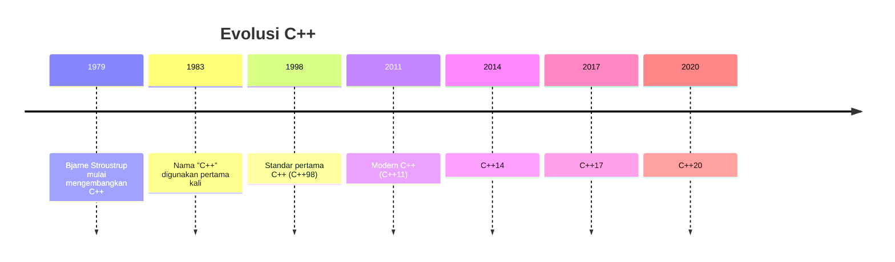

# Pengenalan C++ untuk Competitive Programming 

## Apa itu Pemrograman?

Pemrograman adalah seni dan ilmu dalam memberikan instruksi kepada komputer untuk menyelesaikan suatu masalah. Seperti halnya kita berkomunikasi dengan manusia menggunakan bahasa tertentu, kita juga memerlukan "bahasa" khusus untuk berkomunikasi dengan komputer - inilah yang disebut bahasa pemrograman.

## Mengapa C++?

C++ adalah salah satu bahasa pemrograman paling powerful yang banyak digunakan dalam competitive programming. Berikut beberapa alasan mengapa C++ menjadi pilihan utama:

### Kelebihan C++
1. **Kecepatan Eksekusi** - C++ menghasilkan kode yang sangat cepat karena kompilasi langsung ke bahasa mesin
2. **Kontrol Memory** - Memberikan kontrol penuh atas manajemen memori
3. **Standard Template Library (STL)** - Menyediakan struktur data dan algoritma yang siap pakai
4. **Backward Compatibility** - Kompatibel dengan kode C
5. **Community Support** - Memiliki komunitas besar dan dokumentasi yang lengkap

## Sejarah Singkat C++



C++ diciptakan oleh Bjarne Stroustrup pada tahun 1979 di Bell Labs sebagai ekstensi dari bahasa C. Awalnya disebut "C with Classes", nama C++ dipilih sebagai permainan kata dimana "++" adalah operator increment dalam C/C++, menandakan bahwa C++ adalah versi yang ditingkatkan dari C.

## Struktur Program C++

Mari kita lihat struktur dasar program C++:

```cpp
#include <iostream>
using namespace std;

int main() {
    cout << "Hello, Competitive Programming!" << endl;
    return 0;
}
```

### Penjelasan Komponen

1. **#include <iostream>**
   - Ini adalah *preprocessor directive*
   - Memberitahu compiler untuk menyertakan library iostream
   - iostream berisi fungsi input/output seperti `cout` dan `cin`

2. **using namespace std**
   - Memungkinkan kita menggunakan fungsi dari namespace std tanpa prefix
   - Tanpa ini, kita harus menulis `std::cout` alih-alih `cout`
   - Dalam competitive programming, ini membantu menulis kode lebih cepat

3. **int main()**
   - Fungsi utama yang pertama kali dijalankan
   - `int` menandakan fungsi mengembalikan nilai integer
   - Program C++ harus memiliki exactly satu fungsi main

4. **return 0**
   - Menandakan program berakhir dengan sukses
   - 0 berarti tidak ada error

## Competitive Programming dengan C++

Dalam competitive programming, C++ menjadi pilihan populer karena:

1. **Performa Tinggi** 
   ```cpp
   // Contoh efisiensi C++
   vector<int> numbers(1000000);
   sort(numbers.begin(), numbers.end()); // Sangat cepat!
   ```

2. **STL yang Powerful** 
   ```cpp
   // Contoh penggunaan STL
   vector<int> v;           // Dynamic array
   set<int> s;             // Unique sorted elements
   map<string, int> m;     // Key-value pairs
   priority_queue<int> pq;  // Heap
   ```

3. **Sintaks yang Fleksibel** 
   ```cpp
   // Template untuk competitive programming
   #include <bits/stdc++.h> // Include semua library standard
   #define REP(i,n) for(int i=0;i<n;i++)
   typedef long long ll;    // Shorthand untuk long long
   ```

## Tips Memulai

1. **Pelajari Dasar C++ dengan Baik**
   - Syntax dasar
   - Tipe data dan variabel
   - Control flow (if, loop)
   - Functions

2. **Kuasai STL**
   - Vector, Set, Map
   - Algorithm library
   - String manipulation

3. **Latihan Rutin**
   - Codeforces
   - AtCoder
   - SPOJ

## Apa Selanjutnya?

Setelah memahami dasar-dasar C++, kita akan mempelajari:
- Variabel dan tipe data
- Operator dan ekspresi
- Control flow
- Functions dan recursion
- Dan banyak lagi!

---
*Remember: Dalam competitive programming, kecepatan dan efisiensi adalah kunci. C++ memberikan tools yang tepat untuk mencapai hal tersebut!*